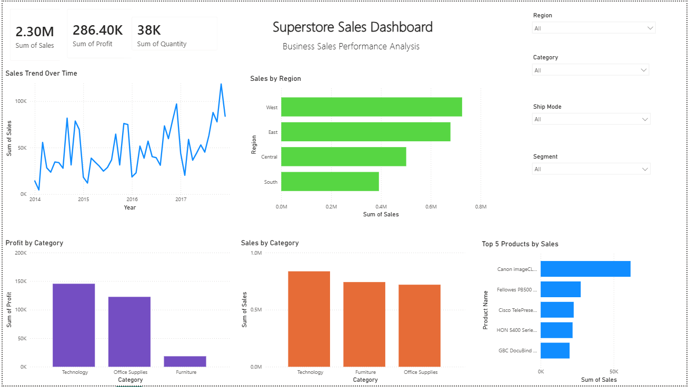

# Superstore Sales Analysis

## Project Objective

The objective of this project is to analyze the Superstore sales dataset using Python. The analysis focuses on identifying sales trends, top-selling products, profitable categories, regional performance, customer behavior, and the impact of discounts on profit.

## Tools Used

- Python
- Pandas
- Matplotlib
- Jupyter Notebook

## Dataset

- Sample Superstore Dataset (.csv)

## Analysis Performed

- Data Loading
- Data Cleaning
- Missing Value Check
- Duplicate Check
- Data Type Analysis
- Monthly Sales Trend
- Top 10 Selling Products
- Sales by Category
- Sales by Region
- Profit by Category
- Top 10 States by Sales
- Top 10 Customers
- Discount vs Profit Analysis

## Business Insights

- Technology generated the highest sales and profit.
- West region recorded the highest sales.
- California was the top-performing state.
- Sean Miller generated the highest sales among customers.
- Higher discounts generally reduced profit.
- Furniture had good sales but comparatively lower profit.

## Conclusion

This analysis provides valuable insights into sales performance and profitability. The findings can help businesses improve decision-making, optimize inventory, and increase overall profit.
## Dashboard Preview

---

## Key Business Insights

- Technology category generated the highest sales.
- The West region recorded the highest overall sales.
- Sales fluctuated over time with noticeable monthly trends.
- A small number of products contributed significantly to total sales.

---

## Business Recommendations

- Increase inventory for high-performing Technology products.
- Focus marketing campaigns on high-performing regions.
- Develop targeted strategies to improve sales in lower-performing regions.
- Monitor top-selling products to maintain consistent revenue growth.
